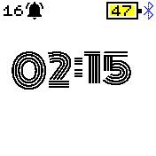

# Pastel Clock - a configurable clock with custom fonts and background

* Designed specifically for Bangle 1 and Bangle 2
* A choice of 7 different custom fonts
* Supports the Light and Dark themes
* Has a settings menu, change font, enable/disable the grid and the date display

I came up with the name Pastel due to the shade of the grid background.

