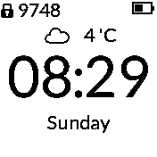

# Pastel Clock

   *a configurable clock with custom fonts, background and optional weather icons. Has a cyclic information line that includes, day, date, battery, sunrise and sunset times*

* Designed specifically for Bangle 1 and Bangle 2
* A choice of 7 different custom fonts
* Supports the Light and Dark themes
* Has a settings menu, change font, enable/disable the grid, weather icons
* On Bangle 1 use BTN1,BTN3 to cycle through the info display (Date, ID, Batt %, Ram % etc)
* On Bangle 2 touch the top right/top left to cycle through the info display (Date, ID, Batt %, Ram % etc)
* The information display will cycle on each screen update
* Uses mylocation.json from MyLocation app to calculate sunrise and sunset times for your location
* Uses pedometer widget to get latest step count
* Use the weather widget to get weather status
* Dependant apps are installed when Pastel installs
* The screen is updated every minute to save battery power
* The weather display will display temperature and wind speed on alternate screen refreshes

I came up with the name Pastel due to the shade of the grid background.

Written by: [Hugh Barney](https://github.com/hughbarney)  For support and discussion please post in the [Bangle JS Forum](http://forum.espruino.com/microcosms/1424/)

## Weather Support

Pastel installs the weather app and weather widget.  You may want to
hide the weather widget display, this can be done through the weather
widget settings.  You should first get the weather app working.  If
the weather App is not working, then it is not going to work for
Pastel.

The following weather icons are supported.

Mostly cloudy, Sunny, Mostly Sunny, Snow, Rain.

The triangle icon shows there is a problem connecting to GadgetBridge and the weather service.
You should follow the setup and trouble shooting guide for the Weather App.

If you find the weather / gadgetbridge service unreliable you can
disable weather updates to pastel through the settings app.

## Fonts

### Lato

### Architect

### Gochihand

### Monoton

### Elite

### Cabin Sketch

### Orbitron

### The Grid

Setting the grid on provides a graph paper style background to the App.
The grid is not supported on a Bangle 1 due to flicker issues.

