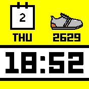
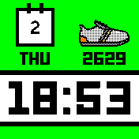
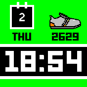

# Pebble

   *a Pebble style clock with configurable background color, to keep the revolution going*      

* Designed specifically for Bangle 2
* A choice of 6 different background colous through its setting menu. Goto Settings, App/Widget settings, Pebble.
* Supports the Light and Dark themes (or set theme independently)
* Uses pedometer widget to get latest step count
* Dependant apps are installed when Pebble installs
* Uses the whole screen, widgets are made invisible but still run in the background
* When battery is less than 30% main screen goes Red
* Optionally show a lock symbol when screen is locked (default off, enable in Settings)

Written by: [Hugh Barney](https://github.com/hughbarney)  For support and discussion please post in the [Bangle JS Forum](http://forum.espruino.com/microcosms/1424/)
