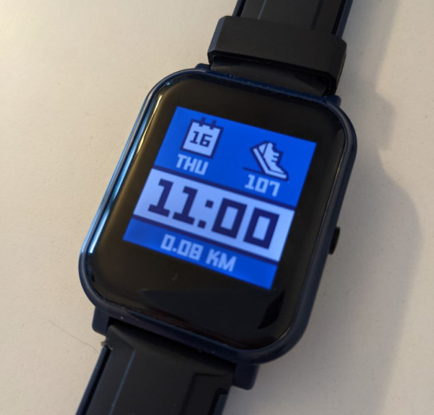

# Pebble with distance and steps

- Forked from [Pebble](https://github.com/espruino/BangleApps/tree/master/apps/pebble)
- Added distance in km (kilometers) based on step length (can be changed in settings and is equal 0.75m by default)
- Battery warning changed to 15% instead of 30%

Initially written by: [Hugh Barney](https://github.com/hughbarney)

Forked and changed by [RomanistHere](https://github.com/RomanistHere)

For support and discussion please post in the [Bangle JS Forum](http://forum.espruino.com/microcosms/1424/)

## How to measure step length

It's much easier than you think. When you're walking, just note number of current steps at two points and then see the distance in any map service. For example, your route from bus station to home. Write number of steps at bus station (let's say 3451) and when you entered your home (3921). You passed 3921 - 3451 = 470 steps. Then see the actual distance in Google maps. Let's say it shows 300 meters. So your step length (in settings) used in app should be 300 / 470 = 0.64. After you have set it, the displayed distance at the main screen should be more accurate.

## Plans

Make step length depend on height/sex/age for lazy ones who don't want to measure it.
