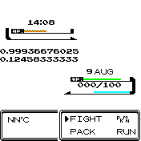

# Pokemon Battle

This watch face seamlessly displays the time, date, battery level, temperature, storage, and RAM usage within a pokemon battle.

## Usage

Download this app to your watch and follow Settings -> System -> Select Clock -> PkMn Btl. The watch face should now be set to the Pokemon Battle.

## Features

A tried and true format including:

- Time
- Date
- Battery level
- Temperature
- Storage available
- RAM usage

### Important

1. The opponent pokemon's name is the **current time**
2. The opponent pokemon's HP is the **available storage**
2. The player pokemon's name is the **date**
3. The player pokemon's HP is the **battery life**
4. The player pokemon's EXP is the **RAM usage**
5. The information box shows the **temperature**

## Requests

For requests or bug reports please [submit an issue](https://github.com/splch/pokebtl/issues/new) on the GitHub page.

## Creator

Spencer Churchill

## Attributions

All icons used in this app are from [icons8](https://icons8.com/). All artwork is from [Pokemon](https://www.pokemon.com/).
