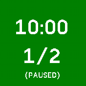
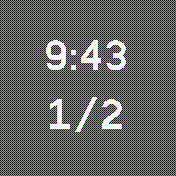
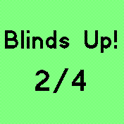

# Poker Timer
*v.0.06*

A blinds timer for poker.  Don't know what that means?  See [Wikipedia: Blind (poker)](https://en.wikipedia.org/wiki/Blind_(poker)) and [Wikipedia: Texas hold 'em](https://en.wikipedia.org/wiki/Texas_hold_%27em). 

The blinds are hardcoded and go up every ten minutes: 

- 1, 2
- 2, 4
- 4, 8
- 5, 10
- 10, 20
- 20, 40
- 40, 80

... and so on, doubling each round.  

## Features

- Starts paused
- Button to pause/resume
- 20-second warning buzz
- Auto-exit after round 25

## Usage

The timer will start as soon as you open the app.  Time left in the round is on the top of the screen, currnt small and big blinds are shown below.  After ten minutes, it will vibrate and flash and show the new blind.  Then it starts over. 

### Auto-exit

The program will automatically exit after the 25 round.  This is not a bug.  If the blinds double again, it will perform some kind of overflow and convert the blind values to floats. 

The blinds in round 25 are `20971520 / 41943040`.  You probably aren't still playing poker at that point and just forgot to exit the program. 

## Controls

 - **Pause/Resume:** Press the button
 - **Exit:** hold down the button 

## Roadmap

- Set settings
- Better graphics

## Requests

[Contact Keith Irwin](https://www.ki9.us/contact/)

## Creator

[Keith Irwin](https://www.ki9.us)
