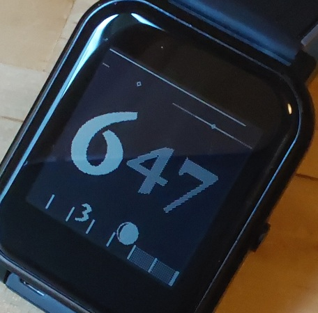

Intended for the dark theme.
The clock does not show widgets but a custom battery indicator.

You can revert this in the code easily by uncommenting the respective lines.

The top line shows battery status.
The line below indicates noon and midnight on 24h timeline.
ToDo: show daylight sunshine duration according to geolocation.
Number in the middle is hour and minutes, in 12h format.
Bottom row: days in the week, with current date, 
and current moon phase placed on the date of 
next change of moon quartal (full moon, half moon etc)

Please report any bugs and feature requests in the forum.
