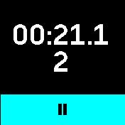
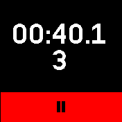
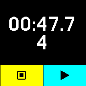
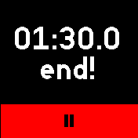

# Presentation Timer

*Forked from Stopwatch Touch*

Simple application to keep track of slides and
time during a presentation. Useful for conferences,
lectures or any presentation with a somewhat strict timing.

The interface is pretty simple, it shows a stopwatch
and the number of the current slide (based on the time),
when the time for the last slide is approaching,
the button becomes red, when it passed,
the time will go on for another half a minute and stop automatically.

You can set personalized timings from the web interface
by uploading a CSV to the bangle (floppy disk button in the app loader).

Each line in the file (`presentation_timer.csv`)
contains the time in minutes at which the slide
is supposed to finish and the slide number,
separated by a semicolon.
For instance the line `1.5;1` means that slide 1
is lasting until 1 minutes 30 seconds (yes it's decimal),
after another slide will start.
The only requirement is that timings are increasing,
so slides number don't have to be consecutive,
some can be skipped and they can even be short texts.

In case the series of slide numbers/names is strictly increasing and doesn't
contain strings, but numbers are not consecutive integers, the app will
interpolate intermediate slides (i.e. the first slide in the csv is 5 at minute
5, the app will add slide 1 at minute 1, slide 2 at minute 2, etc.)

At the moment the app is just quick and dirty but it should do its job.

## Screenshots






## Example configuration file

_presentation_timer.csv_
```csv
1.5;1
2;2
2.5;3
3;4
```
