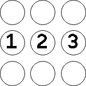
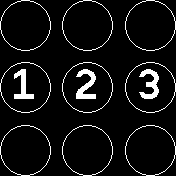
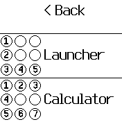
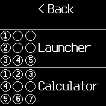

# Pattern Launcher

Directly launch apps from the clock screen with custom patterns.

## Usage

Create patterns and link them to apps in the Pattern Launcher app.

Then launch the linked apps directly from the clock screen by simply drawing the desired pattern.

## Add Pattern Screenshots

## Manage Pattern Screenshots

## Detailed Steps

From the main menu you can:
- Add a new pattern and link it to an app (first entry)
    - To create a new pattern first select "Add Pattern"
    - Now draw any pattern you like, this will later launch the linked app from the clock screen
    - You can also draw a single-circle pattern (meaning a single tap on one circle) instead of drawing a 'complex' pattern
    - If you don't like the pattern, simply re-draw it. The previous pattern will be discarded.
    - If you are happy with the pattern tap on screen or press the button to continue
    - Now select the app you want to launch with the pattern.
    - Note, you can bind multiple patterns to the same app.
- Manage created patterns (second entry)
    - To manage your patterns first select "Manage Patterns"
    - You will now see a scrollabe list of patterns + linked apps
    - If you want to deletion a pattern (and unlink the app) simply tap on it, and confirm the deletion
- Disable the lock screen on the clock screen from the settings (third entry)
    - To launch the app from the pattern on the clock screen the watch must be unlocked.
    - If this annoys you, you can disable the lock on the clock screen from the setting here

## FAQ

1) Nothing happens when I draw on the clock screen!

Please double-check if you actually have a pattern linked to an app.

2) I have a pattern linked to an app and still nothing happens when I draw on the clock screen!

Make sure the watch is unlocked before you start drawing. If this bothers you, you can permanently disable the watch-lock from within the Pattern Launcher app (via the Settings).

3) I have done all that and still nothing happens!

Please note that drawing on the clock screen will not visually show the pattern you drew. It will start the app as soon as the pattern was recognized - this might take 1 or 2 seconds! If still nothing happens, that might be a bug, sorry!
