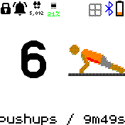

# Pushups 

Pushups is an exercising app with a twist : the accelerometer.

I initially just wanted a pushups counter but i kind of got out of hand.

The accelerometer will work on the following exercises :

- pushups
- situps
- squats
- jumping jacks

For each of them it will try to detect two positions (for example up and down for pushups)
and buzz on each change. You can set up a target counter for each exercise.

Precision is not 100% but it's good for me and kind of increases my motivation.

Other activities are time based like

- plank
- rest

Define your training routine, set a duration and you're ready to go.

## Creator

Feel free to give me feedback : is it useful for you ? what other features would you like ?

frederic.wagner@imag.fr
