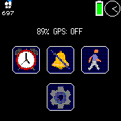

# Quick Center

An app with a status bar showing various information and up to six shortcuts for your favorite apps!
Designed for use with any kind of quick launcher, such as Quick Launch or Pattern Launcher.

## Usage

Pin your apps with settings, then launch them with your favorite quick launcher to access them quickly.
If you don't have any apps pinned, the settings and about apps will be shown as an example.

## Features

Battery and GPS status display (for now)
Up to six shortcuts to your favorite apps

## Upcoming features
- Quick switches for toggleable features such as Bluetooth or HID mode
- Customizable status information