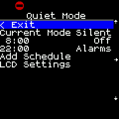
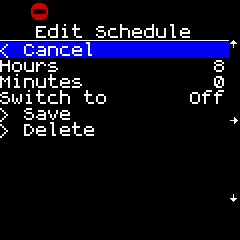
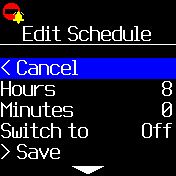
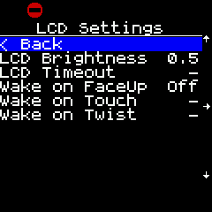
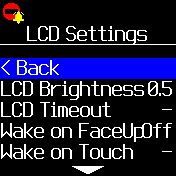

# Quiet Mode Schedule and Widget

Automatically turn Quiet Mode on or off at set times, and display a widget when Quiet Mode is active.

|                  Bangle.js 1                  |                  Bangle.js 2                  |
|:---------------------------------------------:|:---------------------------------------------:|
|             (widget: Silent mode)             |              (widget: Alarms mode)            |
|           |           |
|  |  |
|     |     |

### Switch Theme:

Switch to dark theme during Quiet Mode.
 * **NOTE**: This switches between the default "Dark BW" and "Light BW" themes, so custom theme settings will be lost.

### Options:

If set, these override the default LCD and theme settings while Quiet Mode is active.
