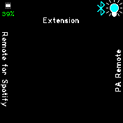

**PLEASE NOTE: With v0.12 of Quick Launch the keys of the settings file have been changed. Please just visit Settings->Apps->Quick Launch to prompt an automatic update. Quick Launch will not be responsive until this has been done. This is a consequence of how the new stackable extension screens are implemented.**

Tap or swipe left/right/up/down on your clock face to launch up to five apps of your choice. The extension (included) can be chosen as one of the apps, in turn providing fast access to up to five additional apps per extension screen - which can be stacked indefinitely. Configurations can be accessed through Settings->Apps.

Below are extension screens where current apps have been set like so: 
- left swipe is "PA Remote",
- right swipe is "Remote for Spotify" and
- down swipe is another extension screen where new apps are accessible. 

*Extension screen.*

*Extension screen when Fastload Utils is present.*

## Contributors

frigis1 (Creator),
halemmerich,
thyttan,
glemco.
