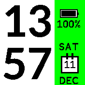

# Rebble

   *A Pebble style clock, with configurable background, three sidebars including steps, day, date, sunrise, sunset, long live the rebellion*

* Designed specifically for Bangle 2
* A choice of 6 different background colous through its setting menu. Goto Settings, App/Widget settings, Rebble.
* Supports the Light and Dark themes
* Has 3 sidebars that cycle including steps, day, date, sunrise, sunset
* Uses pedometer widget to get latest step count
* Dependant apps are installed when Rebble installs
* Uses the whole screen, widgets are made invisible but still run in the background

## Future Enhancements

* Support for Weather Icons in the Steps Sidebar
* Improved small font
* Improved icons

Written by: [Hugh Barney](https://github.com/hughbarney)  For support and discussion please post in the [Bangle JS Forum](http://forum.espruino.com/microcosms/1424/)
