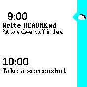
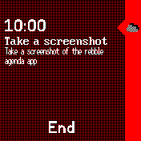
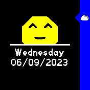

# Rebble Agenda

Agenda app for showing upcoming events in an animated fashion.
Heavily inspired by the inbuilt agenda of the pebble time.  
Switch between calendar events by swiping up or down. Click the button to exit.

    

## Settings

- *Use system theme* - Use the colors of the system theme. Otherwise use following colors.
- *Accent* - The color of the rightmost accent bar if not following system theme.
- *Background* - The background color to use if not following system theme.
- *Foreground* - The foreground color to use if not following system theme.

## Notes

- The weather icon in the top right corner is currently just showing the current weather as provided by [weather](https://github.com/espruino/BangleApps/blob/master/apps/weather/). Closest forecast to be implemented in a future release.
- Events only show as much of their title and description as can be fit on the screen, which is one and four (wrapped) lines respectively.
- Events are loaded from ```android.calendar.json```, which is read in its entirety. If you have a very busy schedule, loading may take a second or two.

## Creator

- [Sarah Alrøe](https://github.com/SarahAlroe), August+September 2023
