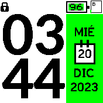
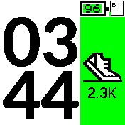
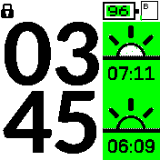

# Rebble Mod

Changes from the original Rebble clock:

* Widgets bar is visible.
* Battery meter was removed from the first page (so you can use your favorite widget).
* Current year added to the first page.
* Second page only has the steps counter.

# Original Rebble Features

* Designed specifically for Bangle 2
* A choice of 6 different background colous through its setting menu. Goto Settings, App/Widget settings, Rebble.
* Supports the Light and Dark themes
* Low power drain, only redraws once per minute
* Has 3 sidebars that cycle including date, steps, sunrise and sunset
* Tap top or bottom right to instantly cycle to the next sidebar
* Uses pedometer widget to get latest step count
* Dependant apps are installed when Rebble installs
* The icon is James Dean - 'Rebel Without a Cause'

Original Rebble written by: [Hugh Barney](https://github.com/hughbarney)
