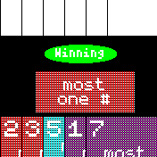

# Red 7 Card Game

Play the card game Red 7 on your Bangle.js.

For rules, see [here](https://asmadigames.com/Red7Rules.pdf).

## Usage

Current rule card is shown in center of screen when viewing your hand.
Swipe left to see your palettes and right on the palette screen to go back to your hand. Tap on a card to see it's details and then swipe either left or right to play the card as a rule or a palette card. Taping anywhere besides the card will dismis the card details.
Press the watch button to bring up the menu, which you can undo your card plays, end your turn, or start a new game.

## Creator
[Kevin Whitaker](https://www.eyecreate.org)
