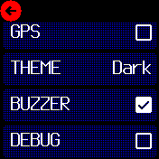

# Regatta Timer 5-4-1 countdown

## Modes

* **Idle**
  On startup the application is in idle mode showing a large 5 in the centre of the screen and the time of day below.
  `Button` switches to start mode.
* **Start**
  During the countdown, the screen changes the layout several times to use as much space as
  possible to display the numbers.
  When time is up the buzzer sounds and the application switches to race mode.
  `Button` switches to idle mode.
* **Race**
  Race time, local time, SOA, number reachable GPS satellites and battery level are shown.
  `Button` switches to "stopped mode".
* **Stoped**
  The race counter stops.
  `Button` switches to idle mode.

## Screenshots

*Idle mode: showing a big 5 and time of day below*

*Start mode: minutes and seconds*

*Start mode: seconds*

*Race mode: elapsed time, time of day, speed, satellites, battery*

*Race mode: with german abbreviations*

*Settings page: main*

*Settings page: choose the theme*

## Localization

Localization is done by the Bangle.js 2 app "Languages"
* Go to [banglejs.com/apps](https://banglejs.com/apps/)
* Search for app "Languages"
* Click the "arrow up" or "burger" icon
* Choose your language from the dropdown
* Click `upload`

**Some nautical abbreviations which are not part of the "Languages" app are stored in `translations.json`.**

## Feedback

Report bugs or request a feature at [github.com/naden](https://github.com/naden)

## Roadmap
* add a second coundown layout; mimic a classic regatta chronograph
* add recording of gps course and race time
* add flag icons for start mode screen

## Created by
&copy; 2021 - 2024 [naden.de](https://naden.de)
