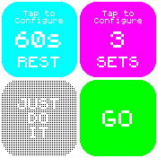

# Rest - Workout Timer

An app to keep track of time when not lifting things and keep track of your sets when lifting things.

## Usage

Install the app. Set the number of sets and the rest between sets. Once you tap "GO" the app is only
operated using the physical button on the watch, to avoid accidental touches during workout.

The watch will vibrate to let you know when your rest time is up.

## Credits

Created by: devsnd
