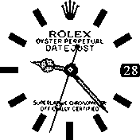

# Rolex

 

Created with the aid of the Espruino documentation and looking through many of the wonderful exising watchfaces that have been made.
This has not been tested on a watch yet as I haven't aquired one but has been tested in the emulator.
The hands don't rotate dead on center but they're as close as I could get them to.

Colour switches based on watch theme so if you want a white on black change your watch theme to dark, and for black on white change it to light.

Special thanks to: 
* rozek (for his updated widget draw code for utilization with background images)
* Gordon Williams (Bangle.js, watchapps for reference code and documentation)
* The community (for helping drive such a wonderful project)
