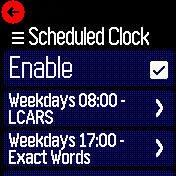
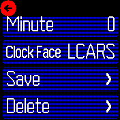

# Schedule Clock Faces

Change clock faces on a schedule.

For example: a fun clock face for weekends and after work; a detailed clock face for work days.

## Usage

* Open the `Schedule Clock` app or find it in the `Settings` > `Apps` menu.
* Set `Enabled` to checked
* Select `Add New` to add a new scheduled face change
* Select the `Day`, `Hour`, `Minute`, and what `Clock` to change to
* Select `Save` to save the new (or changed) schedule

An entry in `Scheduler` will be created for each scheduled clock change.

If the clockface you selected has been uninstalled, the schedule will still exist but won't do anything.

## To Uninstall
Before uninstalling this app, clean up any scheduled alarms by setting the `Enabled` toggle to unchecked.

If you skip this step, orphaned alarms may cause error logs but won't affect functionality.

You can also remove the extra `schedclock` alarms manually with the [Scheduler](/?id=sched) app.

## Fastload Utils

If you are using `Fastload Utils` (https://banglejs.com/apps/?id=fastload) it may not load the new face until the next time it does a full load.

You may be able to work around this by enabling FastLoad's setting to detect settings changes.

## Creator

[kidneyhex](https://github.com/kidneyhex)

## Attribution

App icon: [Schedule](https://icons8.com/icon/E7VlDozxin8k/schedule) by [Icons8](https://icons8.com/)