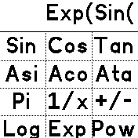

# SciCalc

Simple scientific calculator. I needed one, so I wrote a basic one, no design frills. Input expressions are slightly post processed and then evaluated
by the JS interpreter.

## Usage

Buttons are arranged on 3 separate screens, swiping up or down switches between them. Swiping right has the same effect as hitting the "=" button. Swiping left has the same effect as hitting the "<" button.

## Features

The calculator supports the following operations:

 * basic arithmetic: +, -, *, /, ^ (raise to a power), +/- (invert sign), 1/x (inverse), use of parentheses
 * trigonometric fucntions: sin, cos, tan, asin, acos, atan
 * exponential exp, natural logarithm log, pow function (this one takes 2 comma separated arguments)
 * Pi is provided as a constant
 * a memory button "M" stores or recalls the last result (after hitting the "=" button or swiping down)

