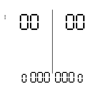

This app will allow you to keep scores for most kinds of sports.

# Keybinds
To correct a falsely awarded point simply open and close the menu within .5 seconds. This will put the app into correction mode (indicated by the `R`).
In this mode any score increments will be decrements. To move back a set, reduce both players scores to 0, then decrement one of the scores once again.

## Screenshot

## Bangle.js 1
| Keybinding          | Description                  |
|---------------------|------------------------------|
| `BTN1`              | Increment left player score  |
| `BTN3`              | Increment right player score |
| `BTN2`              | Menu                         |
| touch on left side  | Scroll up                    |
| touch on right side | Scroll down                  |

## Bangle.js 2
| Keybinding                          | Description                  |
|-------------------------------------|------------------------------|
| `BTN1`                              | Menu                         |
| touch on left side of divider line  | Increment left player score  |
| touch on right side of divider line | Increment right player score |

# Settings
| Setting                            | Description                                                                                                                  |
|------------------------------------|------------------------------------------------------------------------------------------------------------------------------|
| `Presets`                          | Enable a preset for one of the configured sports                                                                             |
| `Sets to win`                      | How many sets a player has to win before the match is won (Maximum sets: this*2-1)                                           |
| `Sets per page`                    | How many sets should be shown in the app. Further sets will be available by scrolling (ignored if higher than `Sets to win`) |
| `Score to win`                     | What score ends a given set                                                                                                  |
| `2-point lead`                     | Does winning a set require a two-point lead                                                                                  |
| `Maximum score`                    | Should there be a maximum score, at which point the two-point lead rule falls away (ignored if lower than Sets to win)       |
| `Tennis scoring`                   | If enabled, each point in a set will require a full tennis game                                                              |
| `TB sets?`                         | Should sets that have reached `(maxScore-1):(maxScore-1)` be decided with a tiebreak                                         |
| All other options starting with TB | Equivalent to option with same name but applied to tiebreaks                                                                 |

The settings can be changed both from within the app by simply pressing `BTN2` (`BTN1` on Bangle.js 2) or in the `App Settings` in the `Settings` app.

If changes are made to the settings from within the app, a new match will automatically be initialized upon exiting the settings.

By default the settings will reflect Badminton rules.

## Tennis Scoring
While tennis scoring is available, correcting in this mode will reset to the beginning of the current game.
Resetting at the beginning of the current game will reset to the beginning of the previous game, leaving the user to fast-forward to the correct score once again.

This might get changed at some point.
