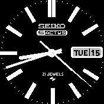

# Seiko 5actus

This is built on the knowledge of what I gained through designing the rolex watch face and improves on it by getting more done right at the start.

This watch is modeled after one I personally own and love, I have spent quite a bit of time designing this in a pixel art editor to try and make it as clean as possible and am quite happy with how it came out.

This watch face works in both the light and dark themes but I personally think it looks a lot cleaner in the dark them.

This watch whilst technically designed in a way that would work with the BangleJs has been only listed to work with the BangleJs2, if someones wants to test it on a first gen and let me know if it works then i'll allow it to be installed on both devices but I assume with how the images have been designed it would look strange on a first gen watch.

Special thanks to: 
* rozek (for his updated widget draw code for utilization with background images)
* Gordon Williams (Bangle.js, watchapps for reference code and documentation)
* The community (for helping drive such a wonderful project)
