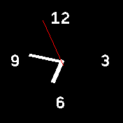

# Simple Analog Clock #

This app displays a simple, yet stylish, analog clock. It considers the
currently configured "theme" (and may therefore look different than shown in
the screenshot on your watch depending on which theme you prefer).

This clock also acts as an example for the building blocks found in the author's
[GitHub repository](https://github.com/rozek/banglejs-2-activities)

## License ##

[MIT License](LICENSE)
