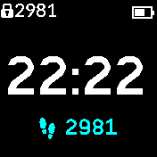
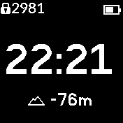
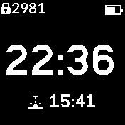

# Simplest++ Clock

The simplest working clock, with clock_info

Simplest++ has 1 clock info menu that is displayed as a single line at the bottom of the screen.

This provides a working demo of how to use the clock_info modules.

## Usage

* When the screen is unlocked, tap at the bottom of the csreen on the information text.
  It should change color showing it is selected.

* Swipe up or down to cycle through the info screens that can be displayed
  when you have finished tap again towards the centre of the screen to unselect.

* Swipe left or right to change the type of info screens displayed (by default
  there is only one type of data so this will have no effect)

* Settings are saved automatically and reloaded along with the clock.

## About Clock Info's

* The clock info modules enable all clocks to add the display of information to the clock face.

* The default clock_info module provides a display of battery %, Steps, Heart Rate and Altitude.

* Installing the [Sunrise ClockInfo](https://banglejs.com/apps/?id=clkinfosunrise) adds Sunrise and Sunset times into the list of info's.

## References

* [Clock Info Tutorial](http://www.espruino.com/Bangle.js+Clock+Info)

* [How to load modules through the IDE](https://github.com/espruino/BangleApps/blob/master/modules/README.md)

## With Thanks

* Gordon for support
* David Peer for his work on BW Clock

Written by: [Hugh Barney](https://github.com/hughbarney) For support
and discussion please post in the [Bangle JS
Forum](http://forum.espruino.com/microcosms/1424/)
