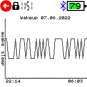
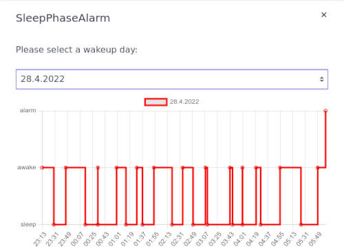

# Sleep Phase Alarm

The alarm must be in the next 24h.

The display shows:

- The current time.
- Time of the next alarm or timer.
- Time difference between current time and alarm time (ETA).
- Current state of the ESS algorithm, "Sleep" or "Awake", useful for debugging. State can also be "Deferred", see the "Run before alarm"-option.

Replacing the watch strap with a more comfortable one (e.g. made of nylon) is recommended.

## Settings

* **Keep alarm enabled**
  - Yes: (default) Alert will stay enabled, e.g. for an alarm at 7:00 the clock will buzz at the calculated time from the ESS algorithm (for example 6:45) and again at 7:00.
  - No: No action at configured alarm time from scheduler.
* **Run before alarm**
  - disabled: (default) The ESS algorithm starts immediately when the application starts.
  - 1..23: The ESS algorithm starts the configured time before the alarm. E.g. when set to 1h for an alarm at 7:00 the ESS algorithm will start at 6:00. This increases battery life.

## Logging

For each day of month (1..31) the ESS states are logged. An entry will be overwritten in the next month, e.g. an entry on the 4th May will overwrite an entry on the 4th April.
On Bangle.js 1 only one day is logged due to low memory.
The logs can be plotted from the settings menu:

The logs can also be viewed with the download button in the App Loader:

