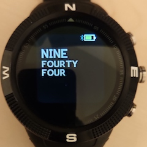
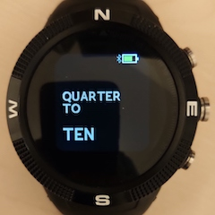
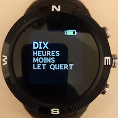
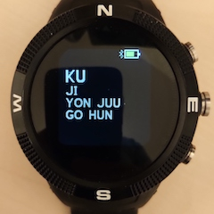
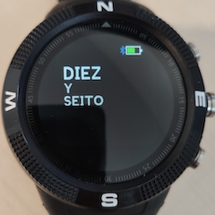
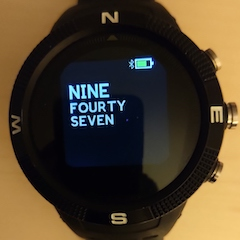
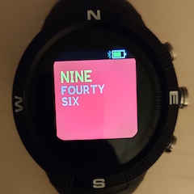
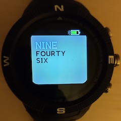
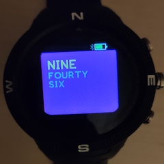

# Sliding Text Clock - See the time in different languages

Inspired by the Pebble sliding clock, old times are scrolled off the screen and new times on. You are also able to change language on the fly so you can see the time written in other languages using button 1. Please use the upload page to choose which languages you want loaded.

## Usage

### Button 1

Use Button 1 (the top right button) to change the language

|   English   |  English (Traditional)    |  French    | Japanese (Romanji) |
| ---- | ---- | ---- | ---- |
|      |      |   |    |
|   **German**   |  **Spanish**    |      |  |
|      |      | |    |

### Button 3
Button 3 (bottom right button) is used to change the colour

|  Black   |  Red    |  Gray    |  Purple    |
| ---- | ---- | ---- | ---- |
|    |  |     |    |

## Further Details

For further details of design and working please visit [The Project Page](https://www.notion.so/adrianwkirk/Sliding-Text-Clock-a8fe556f03624a619656ddbc4f36f41b)

## Requests

Reach out to adrian@adriankirk.com if you have feature requests or notice bugs.

## Creator

Made by [Adrian Kirk](mailto:adrian@adriankirk.com)
