# Sliding Text Clock - See the time in different languages

Inspired by the Pebble sliding clock, previous times are scrolled off the screen and new times scrolled on. There are a variety of colours schemes, clock faces and languages available through the settings menu 

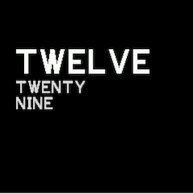

## Settings

Please go to the sliding text clock menu under the settings menu to customise clock. Settings -> Apps -> Sliding Clock

## Colour

The colour selection allows to select between different colour schemes. Colour schemes that are currently available are:

- White background  with black lettering
- Black background with red and white lettering
- Red background with yellow and white lettering.
- Grey background with black and white lettering
- Purple with yellow and white lettering
- Blue with yellow and white lettering

## Live Control

Live control allows you to change the colour scheme of the clock by pressing 

- The bottom right hand corner of the screen for a bangle 2
- Button 3 on on a bangle 1

When select the watch will move to the next colour in the scheme. The selected colour will not be saved so it will will revert to the last colour select in the menu when the clock is restarted. This option is included to help select the preferred colour with having to continuously go back to the settings menu.

The Live Control is turned off by default on a bangle 2, but is on by default for a bangle 1

## Style

Style controls the clock face.

### English

| Style  | English 1                                       | English 1 Alternative                                        | English 2                                | English 2 Alternative                                  | English Hybrid                                            |
| ------ | ----------------------------------------------- | ------------------------------------------------------------ | ---------------------------------------- | ------------------------------------------------------ | --------------------------------------------------------- |
| Screen | 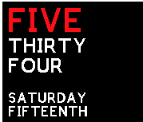         | 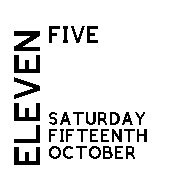                  | 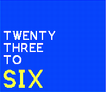 | 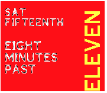           | 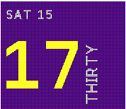                    |
| Notes  | Straight 12 hour English time and Date in words | Straight 12 hour English time and Date in words in alternative style | Traditional English Time                 | Traditional English Time and Date in alternative style | 24 Hour clock  in numbers with minutes  and date in words |

### French
| Style  | French         |
| ------ | -------------- |
| Screen | 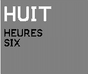 |

### Spanish
| Style  | Spanish         |
| ------ | -------------- |
| Screen | 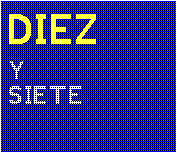 |

### German 

| Style  | German 12 Hour | German 24 Hour |
| ------ | -------------- | -------------- |
| Screen | 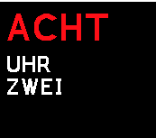 | |
| Notes  | 12 Hour German clock in words | 24 Hour German clock in words |

### Japanese

| Style  | Japanese                                 |
| ------ | ---------------------------------------- |
| Screen | 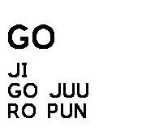 |
| Notes  | Simplified Romanji Japanese Clock.       |

### Digital

| Style  | Digits                                  |
| ------ | --------------------------------------- |
| Screen | 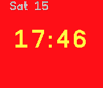 |
| Notes  | Sliding version of a digital clock      |

## Further Details

For further details of design and working please visit [The Project Page](https://www.notion.so/adrianwkirk/Sliding-Text-Clock-a8fe556f03624a619656ddbc4f36f41b)

## Requests

Thank you so much for the feedback so far. Please reach out to adrian@adriankirk.com if you have feature requests or notice bugs.

## Creator

Made by [Adrian Kirk](mailto:adrian@adriankirk.com)
