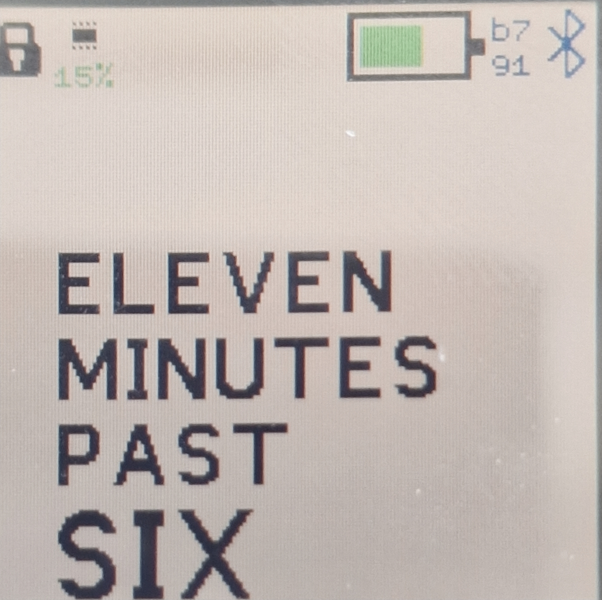
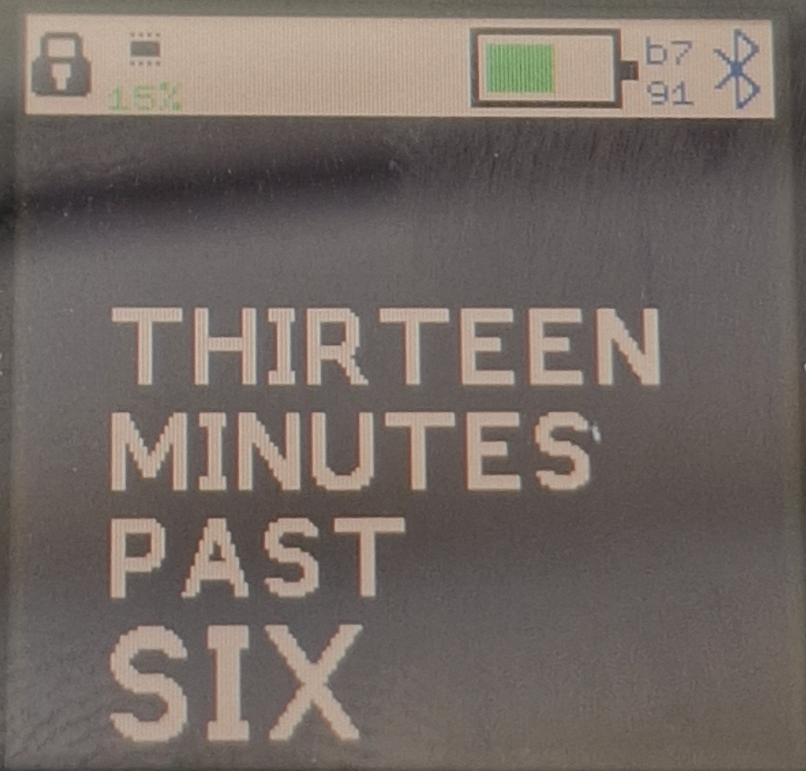
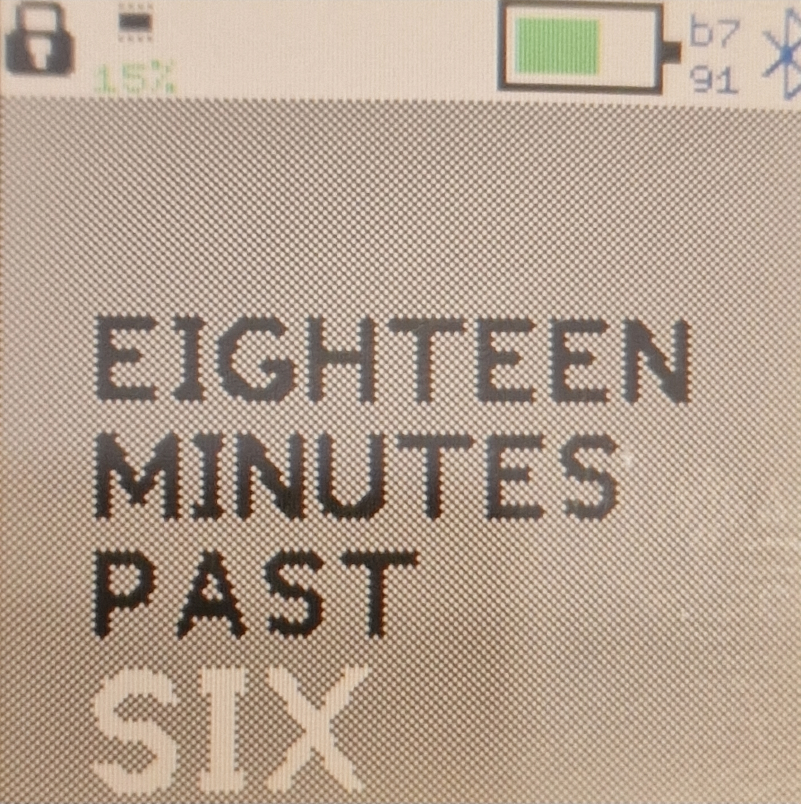
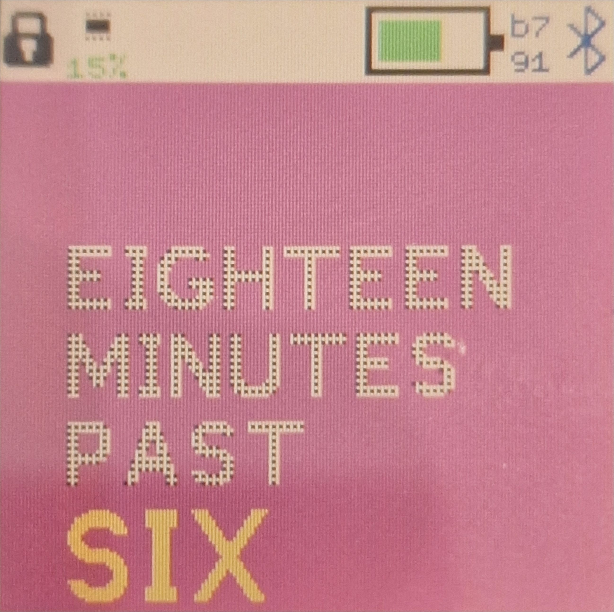
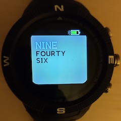

# Sliding Text Clock - See the time in different languages

Inspired by the Pebble sliding clock, old times are scrolled off the screen and new times on. You are also able to change language on the fly so you can see the time written in other languages using button 1. Please use the upload page to choose which languages you want loaded.

## Usage

### Bangle 2

The Bangle 2 has Live Controls switched **off** by default so the colour and language have to be changed from the setting Menu.
Please locate the Sliding Text clock under the setting->apps menu.

With the Live Controls switched on:
#### Bottom right hand corner press
press the bottom right hand corner of the screen to change the colour

| White                | Black                | Gray                 | Red                  |
|----------------------|----------------------|----------------------|----------------------|
|  |  |  |  |

#### Top right hand corner press
press the top right hand corner of the screen to change the language

### Bangle 1

By Default the Live Controls (The side buttons) are switched on, which means the clock face can be controlled dynamically using the 2 side buttons on the right hand side

#### Button 1

Use Button 1 (the top right button) to change the language

|   English   |  English (Traditional)    |  French    | Japanese (Romanji) |
| ---- | ---- | ---- | ---- |
|      |      |   |    |
|   **German**   |  **Spanish**    |      |  |
|      |      | |    |

#### Button 3
Button 3 (bottom right button) is used to change the colour

|  Black   |  Red    |  Gray    |  Purple    |
| ---- | ---- | ---- | ---- |
|    |  |     |    |

#### Settings

To turn off the Live Controls and change the settings statically please visit the settings menu. The settings menu will allow you to:
- Colour Scheme
- Language
- Live Controls (On or Off)

## Further Details

For further details of design and working please visit [The Project Page](https://www.notion.so/adrianwkirk/Sliding-Text-Clock-a8fe556f03624a619656ddbc4f36f41b)

## Requests

Reach out to adrian@adriankirk.com if you have feature requests or notice bugs.

## Creator

Made by [Adrian Kirk](mailto:adrian@adriankirk.com)
