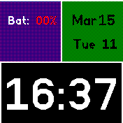
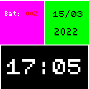

# Monogram Watch Face

Just a simple watch face for the Banglejs2.

It shows battery level in the upper left corner, date information in the upper right, and time information in the bottom.

## Settings

**Analog Clock:** *Not yet implemented.*

**Background:** When the setting is set as "3bit", a background with more accurate colors is chosen for the watchface. Otherwise, it uses a background following the 16-bit Mac Color Palette.

**Date Format:** When the setting is set as "Long", the date is shown in a more human-friendly format (e.g. "Oct 2"), otherwise the date is shown in a standard format (e.g. "02/10"). Default is off.

**Show Week Info:** When the setting is on, the weekday and week number are shown in the upper right box. When the setting is off, the full year is shown instead. Default is off.

**Vector Font:** When the setting is on, the app uses Espruino's vector font, otherwise it uses the default font. Default is off.

## Using the app

Monogram Watch Face can be selected as the default clock or it can be run manually from the launcher. Its settings can be accessed and changed via the relevant menu.

*Tapping on the "Alerts" area will replace the current time display with the time of the most immediate alert.* - *Feature not implemented yet.*
