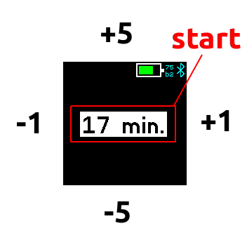

# Simple Timer

A simple app to set a timer quickly. Simply tab on top/bottom/left/right
to select the minutes and tab in the middle of the screen to start/stop
the timer. Note that this timer depends on qalarm.

# Overview
If you open the app, you can simply control the timer
by clicking on top, bottom, left or right of the screen.
If you tab at the middle of the screen, the timer is
started / stopped.

# Creator
[David Peer](https://github.com/peerdavid)

# Thanks to...
Time icon created by <a href="https://www.flaticon.com/free-icons/time" title="time icons">CreativeCons - Flaticon</a>