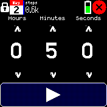
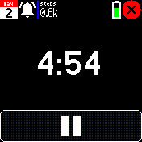
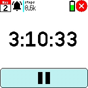
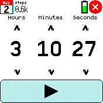

# Simple Timer

A simple app to set a timer quickly. Drag or tap on the up and down buttons over the hour, minute or second to set the time.

This app uses the `sched` library, which allows the timer to continue to run in the background when this app is closed.

# Creators
[David Peer](https://github.com/peerdavid)

[Sir Indy](https://github.com/sir-indy)

# Thanks to...
Time icon created by <a href="https://www.flaticon.com/free-icons/time" title="time icons">CreativeCons - Flaticon</a>