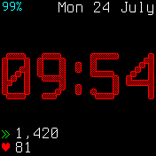
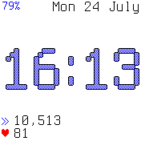

# Snepwatch

Features:
 * This watch face uses the Terminus font.
 * Background, digit-outline, and digit-fill colours are all customizable from the settings menu
 * Text can be configured to either black or white
 * Today's step count is always shown at the bottom
 * Heart-rate is shown when we have a valid reading within the last ten seconds
   * The heart rate monitor can be activated by another app running in the background (eg, Recorder)
   * Or, the heart rate monitor is activated when you unlock the screen (eg, by pressing the button)
   * Sometimes a single unlock-period is not long enough to achieve a usable reading, so a second press can be used
   * The heart rate monitor will be returned to deactivated when the screen remains locked for 15 seconds.
 * Hidden widget-bar. Swipe down to see the widgets.
 * "Sneptember" instead of "September", because snow leopards are excellent :3
 * Fast Loading
