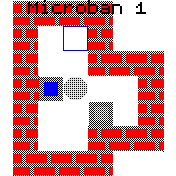

# Sokoban 

Classic Sokoban game.

Tap screen at bottom/top/left/right to push boxes into their destinations.
Swipe to undo.

You play the yellow disk (rice hat seen from above).
Each level has a set of crates (brown if incorrectly placed or blue if correctly placed)
and a set of placeholders (empty blue squares). Simply push all crates into their placeholders.
Remember you can push but never pull.

## Creator

Levels are the [Microban](http://www.abelmartin.com/rj/sokobanJS/Skinner/David%20W.%20Skinner%20-%20Sokoban.htm) levels
by David W. Skinner.

frederic.wagner@imag.fr
