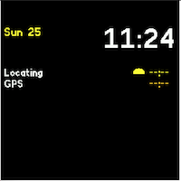
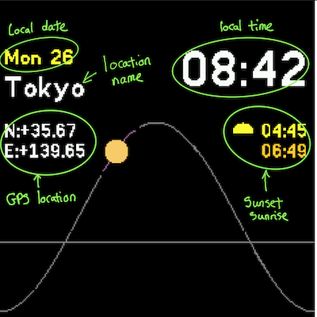
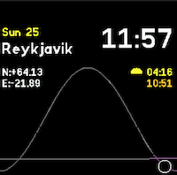
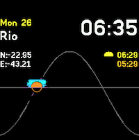
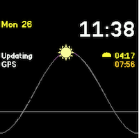
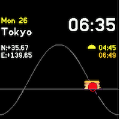
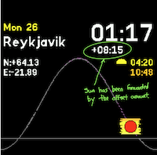

# Solar Clock

## Introduction

Using your current or chosen location the solar watch face shows the Sun's sky position, time and date. Also allows you to wind backwards and forwards in time to see the sun's position

## Usage

## Choosing the locations from the upload page

Please use the webpage to choose the locations you wish to use:

- GPS location will use watches GPS to find your location
- All other entries on the list are popular preset locations

### First use of the clock

After the initial upload the clock will look as follows, if you have chosen the GPS location. Please wait (and go outside) so that the GPS can fix your position

Once the GPS has located your position all the fields will fill out as shown in the next section

### Reading the clock through the day

#### General Layout

The clock face's layout is as follows:

- Whilst using you current local GPS location the location name is left blank. Whilst using a named location this field will be filled in

#### Sun Views through the day

##### Night

During the night the sun will be show as a black circle

##### Dawn

Around dawn the black sun will turn into the dawn sun with a blue sky background

##### Midday

Around midday the corona will surround the sun

##### Sunset

At sunset the sun will go sunset red and the surrounding sky with a sunset sky

### Button 3

Location Change: The clock will change to the appropriate timezone and GPS of the next location by pressing button 3. After all the locations have been selected the first item will be returned to.

### Button 4 and 5
Button 4 (left side of screen) will move the sun backwards in time and button 5 will move the sun forwards in time

### Button 1
A short press of Button 1 by itself will change the time offset back to 0, making the sun go back to its current position
A long press (3 seconds+) of Button 1 will request a GPS update to your current position

## Further Details
For further details of design and working please visit [The Project Page]( https://adrianwkirk.notion.site/Solar-Clock-a2b6268075a6481686b86ecc2094dc14)

## Requests

Reach out to adrian@adriankirk.com if you have feature requests or notice bugs.

## Creator

Made by [Adrian Kirk](mailto:adrian@adriankirk.com)