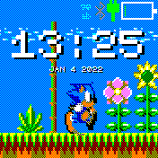

# Sonic Clock

A classic sonic clock featuring run, stop and wait animations.

## Usage

- Sonic will run when the screen is unlocked
- Sonic will stop when the screen is locked
- Sonic will wait when looking at your watch face (when `Bangle.on("twist", fn)` is fired). This option is configurable (see below).

## Configuration

To access the settings menu, you can **double tap** on the **top** side of the watch. The following options are configurable:

- `Active Mode` - catering for 'active' behaviour where the `twist` method can be fired undesirably. When `on` this will prevent the LCD from turning on when a `twist` event is fired.
- `Twist Thresh` - customise the acceleration needed to activate the twist method (see the [`Bangle.setOptions`](https://www.espruino.com/Reference#:~:text=twisted%3F%20default%20%3D%20true-,twistThreshold,-How%20much%20acceleration) method for more info).

### Made with love by [Joseph](https://github.com/Johoseph) 🤗
