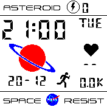

# Space Clock (Casio)

## Description
This watch face is inspired by the Casio Prototype, which was made by Khryzteen Nakamura from Clockology Fans on Facebook.

## Features
- Time and Date
- Weekday
- Temperature
- HeartRate
- Battery
- Step Count
- Support of light and dark theme

## Tips
Click on the heart icon to deactivate the heart rate monitor.
