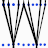

# Space Weaver 

Vector map

Written by: [Pavel Machek](https://github.com/pavelmachek)

Space Weaver is application for displaying vector maps. It is
currently suitable for developers, and more work is needed.

Maps can be created from openstreetmap extracts. Those are cut using
osmosis, then translated into geojson. Geojson is further processes to
add metadata such as colors, and to split it into xyz tiles, while
keeping geojson format. Tiles are then merged into single file, which
can be uploaded to the filesystem. Index at the end provides locations
of the tiles.

## Preparing data

Tools in spacew/prep can be used to prepare data.

You'll need to edit prepare.sh to point it to suitable osm extract,
and you'll need to select area of interest. Start experiments with
small area. You may want to delete cstocs and provide custom
conversion to ascii.

Details of which features are visible at what zoom levels can be
configured in split.js. This can greatly affect file sizes. Then
there's "meta.max_zoom = 17" setting, reduce it if file is too big.

For initial experiments, configure things so that mtar file is around
500KB. (I had troubles with big files, both on hardware and to lesser
extent on simulator. In particular, mtar seemed to be corrupted after
emulator window was closed.)

## Future Development

Directories at the end of .mtar should be hashed, not linear searched.

Geojson is not really suitable as it takes a lot of storage.

Web-based tool for preparing maps would be nice.

Storing 12bit coordinates, but only using 8bits.

Polygons should go first to get proper z-order. 