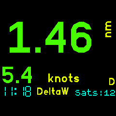

# GPS Speed, Altimeter and Distance to Waypoint

You can switch between three display modes. One showing speed and altitude (A), one showing speed and distance to waypoint (D) and a large dispay of time and selected waypoint.

Within the [A]ltitude and [D]istance displays modes one figure is displayed on the watch face using the largest possible characters depending on the number of digits. The other is in a smaller characters below that. Both are always visible. You can display the current or maximum observed speed/altitude values. Current time is always displayed.

The waypoints list is the same as that used with the [GPS Navigation](https://banglejs.com/apps/#gps%20navigation) app so the same set of waypoints can be used across both apps. Refer to that app for waypoint file information.

## Buttons and Controls

*(Mapping for **Bangle.js 2**: BTN2 = Touch upper right side; BTN3 = Touch lower right side; BTN4 = Touch left side)*

BTN3 : Cycles the modes between Speed+[A]ltitude,  Speed+[D]istance and large Time/Waypoint

### [A]ltitude mode

BTN1 : Short press < 2 secs toggles the displays between showing the current speed/alt values or the maximum speed/alt values recorded.

BTN1 : Long press > 2 secs resets the recorded maximum values. *(Bangle.js 2: Long press > 0.4 secs)*

### [D]istance mode

BTN1 : Select next waypoint. Last fix distance from selected waypoint is displayed.

### Large mode

BTN1 : Select next waypoint.

### All modes

BTN2 : Disables/Restores power saving timeout. Locks the screen on and GPS in SuperE mode to enable reading for longer periods but uses maximum battery drain. Red LED (dot) at top of screen when screen is locked on. Press again to restore power saving timeouts.

BTN3 : Long press exit and return to watch. *(Bangle.js 2: Long press BTN > 2 secs)*

BTN4 : Left Display Tap : Swaps which figure is in the large display. You can have either speed or [A]ltitude/[D]istance on the large primary display.

## App Settings

Select the desired display units. Speed can be as per the default locale, kph, knots, mph or m/s. Distance can be km, miles or nautical miles. Altitude can be feet or metres. Select one of three colour schemes. Default (three colours), high contrast (all white on black) or night ( all red on black ).

## Kalman Filter

This filter smooths the altitude and the speed values and reduces these values 'jumping around' from one GPS fix to the next. The down side of this is that if these values change rapidly ( eg. a quick change in altitude ) then it can take a few GPS fixes for the values to move to the new vlaues. Disabling the Kalman filter in the settings will cause the raw values to be displayed from each GPS fix as they are found.

## Loss of fix

When the GPS obtains a fix the number of satellites is displayed as 'Sats:nn'. When unable to obtain a fix then the last known fix is used and the age of that fix in seconds is displayed as 'Age:nn'. Seeing 'Sats'  or 'Age' indicates whether the GPS has a current fix or not.  

## Screens

Speed and Altitude: 

Left tap swaps displays: 

Distance to waypoint DeltaW: 

MAX Values instead: 

Settings: 

## Power Saving

The The GPS Adv Sport app obeys the watch screen off timeouts as a power saving measure. Restore the screen as per any of the colck/watch apps. Use BTN2 to lock the screen on but doing this will use more battery.

This app will work quite happily on its own but will use the [GPS Setup App](https://banglejs.com/apps/#gps%20setup) if it is installed. You may choose to use the GPS Setup App to gain significantly longer battery life while the GPS is on. Please read the Low Power GPS Setup App Readme to understand what this does.

When using the GPS Setup App this app switches the GPS to SuperE (default) mode while the display is lit and showing fix information. This ensures that that fixes are updated every second or so. 10 seconds after the display is blanked by the watch this app will switch the GPS to PSMOO mode and will only attempt to get a fix every two minutes. This improves power saving while the display is off and the delay gives an opportunity to restore the display before the GPS power mode is switched.

The MAX values continue to be collected with the display off so may appear a little odd after the intermittent fixes of the low power mode.

## Waypoints

Waypoints are used in Distance and VMG modes. See the `Waypoints` app for information on how to create/edit waypoints. The first 6 characters of the name are displayed in Speed+[D]istance mode.

Sample waypoints.json (My sailing waypoints)

<pre>
[
  {
  "name":"NONE"
  },
  {
  "name":"Omori",
  "lat":-38.9058670,
  "lon":175.7613350
  },
  {
  "name":"DeltaW",
  "lat":-38.9438550,
  "lon":175.7676930
  },
  {
  "name":"DeltaE",
  "lat":-38.9395240,
  "lon":175.7814420
  },
  {
  "name":"BtClub",
  "lat":-38.9446020,
  "lon":175.8475720
  },
  {
  "name":"Hapua",
  "lat":-38.8177750,
  "lon":175.8088720
  },
  {
  "name":"Nook",
  "lat":-38.7848090,
  "lon":175.7839440
  },
  {
  "name":"ChryBy",
  "lat":-38.7975050,
  "lon":175.7551960
  },
  {
  "name":"Waiha",
  "lat":-38.7219630,
  "lon":175.7481520
  },
  {
  "name":"KwaKwa",
  "lat":-38.6632310,
  "lon":175.8670320
  },
  {
  "name":"Hatepe",
  "lat":-38.8547420,
  "lon":176.0089124
  },
  {
  "name":"Kinloc",
  "lat":-38.6614442,
  "lon":175.9161607
  }
]
</pre>

## Comments and Feedback

Developed for my use in sailing, cycling and motorcycling. If you find this software useful or have feedback drop me a line mike[at]kereru.com. Enjoy!

## Thanks

Many thanks to Gordon Williams. Awesome job.

Special thanks also to @jeffmer, for the [GPS Navigation](https://banglejs.com/apps/#gps%20navigation) app and @hughbarney for the Low power GPS code development and Wouter Bulten for the Kalman filter code.
