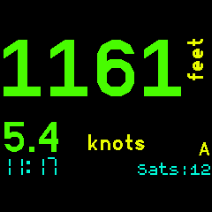

Displays the GPS speed, altitude and distance to selected waypoint. One is displayed on the watch face using the largest possible characters depending on the number of digits. The other is in a smaller characters below that. Both are always visible. You can display the current or maximum observed speed/altitude values. Current time is always displayed. 

You can chose between two modes. One showing speed and altitude (A) and one showing speed and distance to waypoint (D). 

The waypoints list is the same as that used with the [GPS Navigation] app so the same set of waypoints can be used across both apps. Refer to that app for waypoint file information.

Left Display Tap : Swaps the displays. You can have either speed or [A]ltitude/[D]istance on the large primary display.

BTN1 : [Speed+Altitude] Short press < 2 secs toggles the displays between showing the current speed/alt values or the maximum speed/alt values recorded.

BTN1 : [Speed+Altitude] Long press > 2 secs resets the recorded maximum values.

BTN1 : [Speed+Distance] Select next waypoint. Last fix distance from selected waypoint is displayed.

BTN3 : Swaps the modes between Speed+[A]ltitude or Speed+[D]istance.

App Settings : Select the desired display units. Speed can be as per the default locale, kph, knots, mph or m/s. Distance caqn be km, miles or nautical miles. Altitude can be feet or metres. Select one of three colour schemes. Default, high contrast (all white on black) or night ( all red on black ). 

Loss of fix : When the GPS obtains a fix the number of satellites is displayed as 'Sats:nn'. When unable to obtain a fix then the last known fix is used and the age of that fix in seconds is displayed as 'Age:nn'. Seeing 'Sats'  or 'Age' indicates whether the GPS has a fix or not.  

Speed and Altitude: 

Left tap swaps displays: 

Distance to waypoint DeltaW: 

MAX Values instead: 

Settings: 

Developed for my use in sailing, cycling and motorcycling. If you find this software useful or have feedback drop me a line mike[at]kereru.com. Enjoy!

Low Power GPS Service :

This app will work quite happily without this service but will use the Low power GPS Service if it is installed. In this case the GPS Service must be On for this app to obtain a fix. You may choose to use the Low Power GPS Service to gain significantly longer battery life while the GPS is on. Please read the Low Power GPS Service Readme to understand what this does.

When using the Low Power GPS Service this app switches the GPS to SuperE (default) mode while the display is lit and showing fix information. This ensures that that fixes are updated every second or so. 30 seconds after the display is blanked by the watch this app will switch the GPS to PMOO mode and will only attempt to get a fix every minute or two. This improves power saving while the display is off. This delay gives an opportunity to restore the display before the power mode is switched.

There are a couple of things to consider when using the Low Power GPS Service. This app plus the LP GPS service together use a considerable chunk of the Bangle.JS memory. A large waypoints file will also contribute to this. The MAX values continue to be collected with the display off so may appear a little odd after the intermittent fixes of the low power mode. 

Waypoints:

Waypoints are used in [D]istance mode. Create a file waypoints.json and write to storage on the Bangle.js using the IDE. The first 6 characters of the name are displayed in Speed+[D]istance mode.

The GPS Navigation app in the App Loader has a really nice waypoints file editor.

Sample waypoints.json (My sailing waypoints)

<pre>
[
  {
  "name":"NONE"
  },
  {
  "name":"Omori",
  "lat":-38.9058670,
  "lon":175.7613350
  },
  {
  "name":"DeltaW",
  "lat":-38.9438550,
  "lon":175.7676930
  },
  {
  "name":"DeltaE",
  "lat":-38.9395240,
  "lon":175.7814420
  },
  {
  "name":"BtClub",
  "lat":-38.9446020,
  "lon":175.8475720
  },
  {
  "name":"Hapua",
  "lat":-38.8177750,
  "lon":175.8088720
  },
  {
  "name":"Nook",
  "lat":-38.7848090,
  "lon":175.7839440
  },
  {
  "name":"ChryBy",
  "lat":-38.7975050,
  "lon":175.7551960
  },
  {
  "name":"Waiha",
  "lat":-38.7219630,
  "lon":175.7481520
  },
  {
  "name":"KwaKwa",
  "lat":-38.6632310,
  "lon":175.8670320
  },
  {
  "name":"Hatepe",
  "lat":-38.8547420,
  "lon":176.0089124
  },
  {
  "name":"Kinloc",
  "lat":-38.6614442,
  "lon":175.9161607
  }
]
</pre>

Thanks:

Many thanks to Gordon Williams. Awesome job.

Special thanks also to @jeffmer, for the 'GPS Navigation' app and @hughbarney for the 'Low power GPS Service' work.

