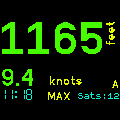

Displays the GPS speed and altitude. One is displayed on the watch face using the largest possible characters depending on the number of digits. The other is in a smaller characters below that. Both are always visible.

Display Tap : Swaps the displays. You can have either speed or altitude on the large display.

BTN3 : Select the desired display units. Speed can be as per the default locale, kph, knots, mph or m/s. Altitude can be feet or metres.

Developed for my use in sailing, cycling and motorcycling. If you find this software useful or have feedback drop me a line mike[at]kereru.com. Enjoy!

( Many thanks to Gordon Williams. Awesome job. )
