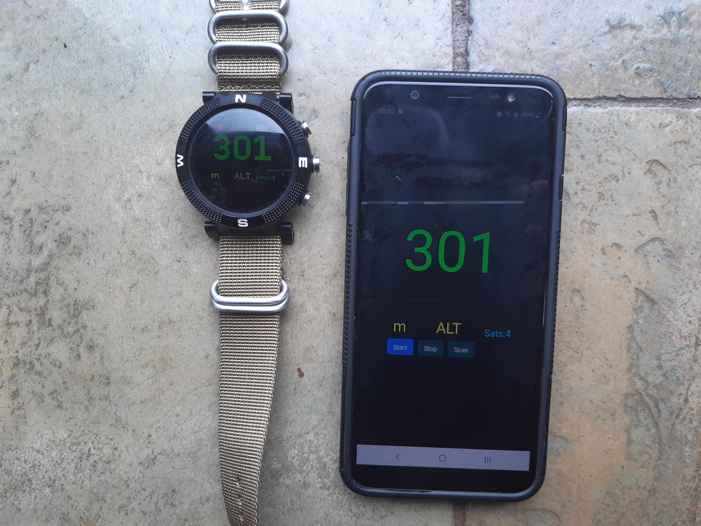

# GPS Speed, Altitude, Distance and VMG

**GPS Adventure Sports II** has 6 screens, each of which displays just one of Speed, Altitude, Distance to waypoint, VMG to waypoint, Position or Time.

The waypoints list is the same as that used with the [GPS Navigation](https://banglejs.com/apps/#gps%20navigation) app so the same set of waypoints can be used across both apps. Refer to that app for waypoint file information.

## Buttons and Controls

**BTN1** ( Speed and Altitude ) Short press < 2 secs toggles the display between last reading and maximum recorded.  Long press > 2 secs resets the recorded maximum values.

**BTN1** ( Distance and VMG ) Select next waypoint. Last fix distance from selected waypoint or speed towards is displayed.

**BTN2** : Disables/Restores power saving timeout. Locks the screen on and GPS in SuperE mode to enable reading for longer periods but uses maximum battery drain. Red LED (dot) at top of screen when screen is locked on. Press again to restore power saving timeouts.

**BTN3** : Cycles the screens between Speed, Altitude, Distance to waypoint, VMG to waypoint, Position and Time

**BTN3** : Long press exit and return to watch.

**Touch Screen** If the 'Touch' setting is ON then :

Swipe Left/Right cycles between the six screens.

Touch functions as BTN1 short press.

## App Settings

Select the desired display units. Speed can be as per the default locale, kph, knots, mph or m/s. Distance can be km, miles or nautical miles. Altitude can be feet or metres. Select one of three colour schemes. Default (three colours), high contrast (all white on black) or night ( all red on black ).

## Kalman Filter

This filter smooths the altitude and the speed values and reduces these values 'jumping around' from one GPS fix to the next. The down side of this is that if these values change rapidly ( eg. a quick change in altitude ) then it can take a few GPS fixes for the values to move to the new values. Disabling the Kalman filter in the settings will cause the raw values to be displayed from each GPS fix as they are found.

## Loss of fix

When the GPS obtains a fix the number of satellites is displayed as 'Sats:nn'. When unable to obtain a fix then the last known fix is used and the age of that fix in seconds is displayed as 'Age:nn'. Seeing 'Sats'  or 'Age' indicates whether the GPS has a current fix or not.  

## Power Saving

The The GPS Adv Sport app obeys the watch screen off timeouts as a power saving measure. Restore the screen as per any of the clock/watch apps. Use BTN2 to lock the screen on but doing this will use more battery.

This app will work quite happily on its own but will use the [GPS Setup App](https://banglejs.com/apps/#gps%20setup) if it is installed. You may choose to use the GPS Setup App to gain significantly longer battery life while the GPS is on. Please read the Low Power GPS Setup App Readme to understand what this does.

When using the GPS Setup App this app switches the GPS to SuperE (default) mode while the display is lit and showing fix information. This ensures that that fixes are updated every second or so. 10 seconds after the display is blanked by the watch this app will switch the GPS to PSMOO mode and will only attempt to get a fix every two minutes. This improves power saving while the display is off and the delay gives an opportunity to restore the display before the GPS power mode is switched.

The MAX values continue to be collected with the display off so may appear a little odd after the intermittent fixes of the low power mode.

## Velocity Made Good - VMG

This implementation of VMG is very simplistic and is simply the component of your current vector ( course and speed ) that is towards your selected waypoint. It is displayed as negative if you are moving away from the waypoint. For it to be displayed you must be moving and the GPS must be able to detemrine a course. If not it will display '---' as the VMG.

## Mirroring to Android

This feature is an optional extra to solve and enhance a specific requirement for me. While sailing the Bangle.js watch screen is very difficult to read in bright sunlight while wearing the polaroid prescription lenses that I require on the water. The solution is to mirror the Bangle.js screen to an android device with a daylight readable OLED screen that I keep in a clear waterproof case on the boat. Using this mirroring feature I can see the GPS Adv Sports II app easily at all times, either on my wrist or on the bigger android device while still having full control over the display via the watch buttons.

There is a caveat. While in use the watch GPS stays in SuperE mode in order to keep the android screen updates going which means a higher battery use on the Bangle.js.

How is this mirroring done?

Install Droidscript on your Android device. Must have BLE suport and the PuckJS plugin installed. The Droidscript script can be found in the BangleApps GIT repository : https://github.com/espruino/BangleApps/tree/master/apps/speedalt2

The Droidscript script file is called : **GPS Adv Sports II.js**

**Important Gotcha :** For the BLE comms to find and connect to the Bangle.js it must be paired with the Android device but **NOT** connected. The Bangle.js must have been set in the Bluetooth settings as connectable.

Start/Stop buttons tell the Bangle.js to start or stop sending BLE data packets to the Android device. While stopped the Bangle.js reverts to full power saving mode when the screen is asleep.

When running a blue 'led' will flash each time a data packet is recieved to refresh the android display.

An orange 'led' will flash for each reconnection attempt if no data is received for 30 seconds. It will keep trying to reconnect so you can restart the Bangle, run another Bangle app or temprarily turn off bluetooth. The android mirror display will automatically reconnect when the GPS Adv Sports II app is running on the Bangle again. ( Designed to leave the Android device running as the display mirror in a sealed case all day while retaining the ability to do other functions on the Bangle.js and returning to the GPS Speed Alt II app. )

Android Screen Mirroring: 

## Waypoints

Waypoints are used in Distance and VMG modes. See the `Waypoints` app for information on how to create/edit waypoints. The first 6 characters of the name are displayed in Speed+[D]istance mode.

By default the waypoints file is called waypoints.json

**Note** : The waypoints.json file is used by a number of different gps apps. The setting 'Wpt File Suffix' allows one of waypoints.1.json, waypoints.2.json or waypoints.3.json to be used instead. This allows the other apps to be used with a different set of waypoints without losing the speedalt2 waypoint set.

Sample waypoints.json (My sailing waypoints)

<pre>
[
  {
  "name":"NONE"
  },
  {
  "name":"Omori",
  "lat":-38.9058670,
  "lon":175.7613350
  },
  {
  "name":"DeltaW",
  "lat":-38.9438550,
  "lon":175.7676930
  },
  {
  "name":"DeltaE",
  "lat":-38.9395240,
  "lon":175.7814420
  },
  {
  "name":"BtClub",
  "lat":-38.9446020,
  "lon":175.8475720
  },
  {
  "name":"Hapua",
  "lat":-38.8177750,
  "lon":175.8088720
  },
  {
  "name":"Nook",
  "lat":-38.7848090,
  "lon":175.7839440
  },
  {
  "name":"ChryBy",
  "lat":-38.7975050,
  "lon":175.7551960
  },
  {
  "name":"Waiha",
  "lat":-38.7219630,
  "lon":175.7481520
  },
  {
  "name":"KwaKwa",
  "lat":-38.6632310,
  "lon":175.8670320
  },
  {
  "name":"Hatepe",
  "lat":-38.8547420,
  "lon":176.0089124
  },
  {
  "name":"Kinloc",
  "lat":-38.6614442,
  "lon":175.9161607
  }
]
</pre>

## Comments and Feedback

Developed for my use in sailing, cycling and motorcycling. If you find this software useful or have feedback drop me a line mike[at]kereru.com. Enjoy!

## Thanks

Many thanks to Gordon Williams. Awesome job.

Special thanks also to @jeffmer, for the [GPS Navigation](https://banglejs.com/apps/#gps%20navigation) app and @hughbarney for the Low power GPS code development and Wouter Bulten for the Kalman filter code.
