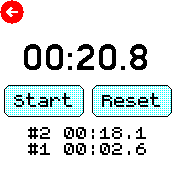

# Stopwatch with split times

A basic stopwatch with support for split times.

## Features

Implemented:

- Start stopwatch
- Stop stopwatch
- Show split times
- Reset stopwatch
- Keep display unlocked

Future:

- Save state and restore running stopwatch when it reopens
- View all split times
- Duplicate Start/Stop and/or Reset/Split button on the physical button
- Settings, e.g. what the physical button does, and whether to keep the backlight on

## Creator

James Taylor ([jt-nti](https://github.com/jt-nti))

## Icons

The same icons as apps/stopwatch! 
