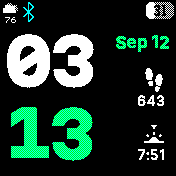

# Stacked Color Clock
Uses the `dailycolor` module to change accent colors every day, with a clean and modern style

The app is designed to be as battery-friendly as possible, and clears certain areas and utilizes string background to remove the need for full screen clears/draws. If any problems arise where the background has another app/doesn't clear properly, simply reload the clock.

## Creator
RKBoss6
