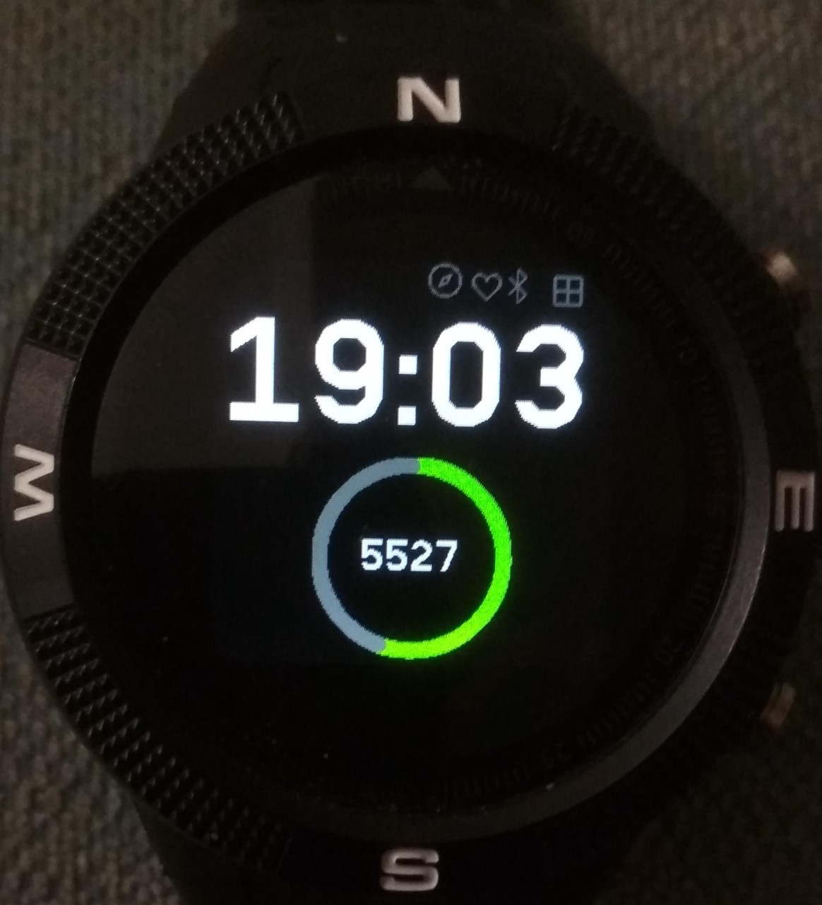

# Stepometer Clock

A larg font watch, displays step count in a doughnut guage and warns of low battery

## Features

- Displays the time in large font
- Display current step count in a doughnut guage
- Show step count in the middle of the doughnut guage
- When the battery is less than 25% the doughnut turns red
- The guage show percentage of steps out of a goal of 10000 steps

# Notes

* Uses an arrayBuffer to prepare the doughnut guage. The arrayBuffer
  is 160*160 and is larger than required. The reason for this is that
  I plane to use this watch face with others in a multiclock format
  and want to be able to reuse the arrayBuffer with other clocks.
