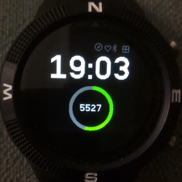
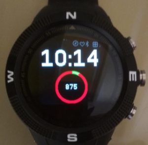

# Stepometer Clock

A large font watch, displays step count in a doughnut guage and warns of low battery

## Features

- Displays the time in large font
- Display current step count in a doughnut guage
- Show step count in the middle of the doughnut guage
- The guage show percentage of steps out of a goal of 10000 steps

## Dependancies
- Requires one of the steps widgets to be installed

- When the battery is less than 25% the doughnut turns red

## BTN2 Long press to start the launcher

BTN2 is confiured to respond to a 1.5 second press in order to switch
to the launcher App. Simply press and hold until you hear a buzz and
release. This avoids accidently switching out of the watch app when
clothing catches it.

## Notes

* Uses an arrayBuffer to prepare the doughnut guage. The arrayBuffer
  is 160*160 and is larger than required. The reason for this is that
  I plan to use this watch face with others in a multiclock format
  and want to be able to reuse the arrayBuffer with other clocks.

Written by: [Hugh Barney](https://github.com/hughbarney) For support
and discussion please post in the [Bangle JS
Forum](http://forum.espruino.com/microcosms/1424/)
