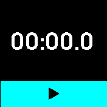

# Stopwatch Touch

A touch screen based stop watch for Bangle 2

## Screenshots

## Features

* Attractive UI design
* Will run up to 99 hours
* Shows 10th of seconds up to 1 hour
* Start / Pause button
* Reset button

## Future features

I'm keen to complete this project with

* Ability to dismiss the app and leave it running in the background
* A small widget to show the elapsed time on the current active clock
* Laptimes, with a way to view all the laptimes on a scrollable screen

## One of these is a genuine Bangle Js 2 Open Source Smartwatch, the other isn't

Which one is which ?

Written by: [Hugh Barney](https://github.com/hughbarney)  For support and discussion please post in the [Bangle JS Forum](http://forum.espruino.com/microcosms/1424/)
