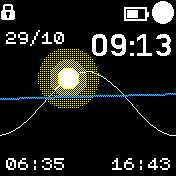

# sunrise watchface

This app mimics the Apple Watch watchface that shows the sunrise and sunset time.

This is a work-in-progress app, so you may expect missfeatures, bugs and heavy
battery draining. There's still a lot of things to optimize and improve, so take
this into account before complaining :-)

* Requires to configure the location in Settings -> Apps -> My Location
* Shows sea level and make the sun/moon glow depending on the x position
* The sinus is fixed, so the sea level is curved to match the sunrise/sunset positions)

## TODO

* Improved gradients and add support for banglejs1
* Faster rendering, by reducing sinus stepsize, only refreshing whats needed, etc
* Show red vertical lines or dots inside the sinus if there are alarms

## Author

Written by pancake in 2023

## Screenshots

