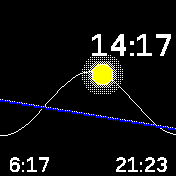

# sunrise watchface

This app mimics the Apple Watch watchface that shows the sunrise and sunset time.

This is a work-in-progress app, so you may expect missfeatures, bugs and heavy
battery draining. There's still a lot of things to optimize and improve, so take
this into account before complaining :-)

* Lat/Lon hardcoded to Barcelona, but it's configurable if you install the "mylocation app"
* Shows sea level and make the sun/moon glow depending on the x position
* The sinus is fixed, so the sea level is curved to match the sunrise/sunset positions)

## TODO

* Access GPS on first start to cache lat+lon to compute sunrise/sunset times
* Cache constant values once
* Show month and day too?
* Improved gradients
* Faster rendering, by reducing sinus stepsize, only refreshing whats needed, etc

## Author

Written by pancake in 2023

## Screenshots

